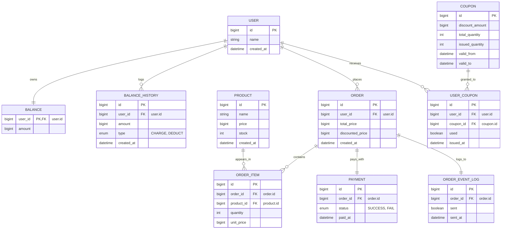

```mermaid
erDiagram
    
    USER {
        bigint id PK
        string name
        datetime created_at
    }
    
    BALANCE {
        bigint user_id PK, FK "user.id"
        bigint amount
    }
    
    BALANCE_HISTORY {
        bigint id PK
        bigint user_id FK "user.id"
        bigint amount
        enum type "CHARGE, DEDUCT"
        datetime created_at
    }
 
    PRODUCT {
        bigint id PK
        string name
        bigint price
        int stock
        datetime created_at
    }
    
    ORDER {
        bigint id PK
        bigint user_id FK "user.id"
        bigint total_price
        bigint discounted_price
        datetime created_at
    }
    
    ORDER_ITEM {
        bigint id PK
        bigint order_id FK "order.id"
        bigint product_id FK "product.id"
        int quantity
        bigint unit_price
    }
    
    COUPON {
        bigint id PK
        bigint discount_amount
        int total_quantity
        int issued_quantity
        datetime valid_from
        datetime valid_to
    }
    
    USER_COUPON {
        bigint id PK
        bigint user_id FK "user.id"
        bigint coupon_id FK "coupon.id"
        boolean used
        datetime issued_at
    }
    
    PAYMENT {
        bigint id PK
        bigint order_id FK "order.id"
        enum status "SUCCESS, FAIL"
        datetime paid_at
    }
    
    ORDER_EVENT_LOG {
        bigint id PK
        bigint order_id FK "order.id"
        boolean sent
        datetime sent_at
    }
    
    %% 관계 정의
    
    USER ||--|| BALANCE : owns
    USER ||--o{ BALANCE_HISTORY : logs
    USER ||--o{ ORDER : places
    USER ||--o{ USER_COUPON : receives
    
    ORDER ||--o{ ORDER_ITEM : contains
    ORDER ||--|| PAYMENT : pays_with
    ORDER ||--|| ORDER_EVENT_LOG : logs_to
    
    PRODUCT ||--o{ ORDER_ITEM : appears_in
    
    COUPON ||--o{ USER_COUPON : granted_to
```
