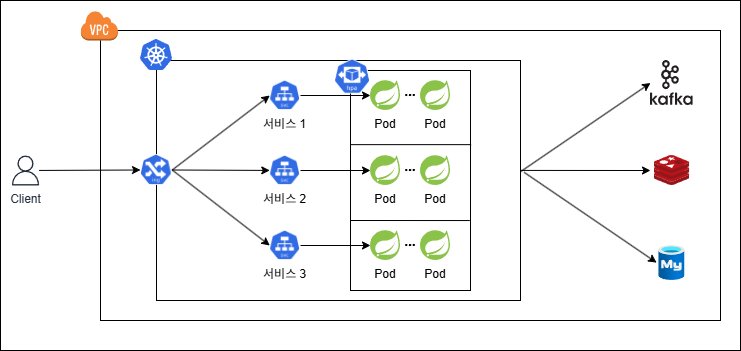

# 🏗️ e-Commerce 인프라 아키텍처 설명

이 문서는 e-Commerce 시스템의 Kubernetes 기반 마이크로서비스 인프라 구조를 설명합니다.

---

## 📌 전체 구성도

---

## ✅ 구성 요소

### 1. 사용자 (Client)
- 웹/모바일 클라이언트에서 API 요청을 보냅니다.
- 요청은 외부 VPC를 통해 Kubernetes 클러스터로 전달됩니다.

### 2. VPC (Virtual Private Cloud)
- 클러스터와 외부 세계를 연결하는 경계입니다.
- AWS, GCP, NCP 등의 클라우드 환경을 가정합니다.

### 3. Ingress Controller (예: NGINX, AWS ALB Ingress Controller)
- 외부 트래픽을 내부 서비스로 라우팅합니다.
- URI 패턴 또는 Host 기반 라우팅 설정이 가능합니다.

### 4. Kubernetes Cluster
- **Spring Boot 기반 마이크로서비스**들이 각각의 **Pod**로 배포됩니다.
- 각 마이크로서비스는 `서비스 1`, `서비스 2`, `서비스 3` 형태로 구성되어 있으며, **Horizontal Pod Autoscaler(HPA)**를 통해 Pod 수가 동적으로 조절될 수 있습니다.

### 5. Service
- Kubernetes Service 객체는 각 마이크로서비스에 안정적인 네트워크 접근을 제공하는 추상화된 엔드포인트입니다.
- 동일한 서비스를 제공하는 여러 Pod 간에 트래픽을 자동으로 부하 분산(Load Balancing) 합니다.

### 6. Redis
- 재고 캐싱, 분산락, 쿠폰 발급 제한 등에 활용됩니다.
- 빠른 응답이 필요한 데이터는 Redis에 저장됩니다.

### 7. MySQL
- 사용자 정보, 주문 내역, 상품 정보 등 **정합성이 필요한 데이터**를 저장합니다.
- 주문 성공 시 최종적으로 모든 데이터를 여기에 기록합니다.

### 8. Kafka
- 주문 성공 시 이벤트를 **실시간 데이터 플랫폼**으로 전송합니다.
- 비동기 처리 구조로 분석 시스템, 실시간 대시보드 등과 연동됩니다.

---

## 🔄 요청 흐름 요약

1. 사용자가 요청 → Ingress Controller
2. 요청 경로에 따라 각 서비스로 분기 (서비스 1~3)
3. 서비스 내부에서 Redis, Kafka, MySQL 등 외부 시스템과 연동
4. Kafka는 비동기 전송, Redis는 캐싱과 락 처리, MySQL은 최종 저장소

---

## 📌 주요 특징

- ✅ 마이크로서비스 구조 (MSA)
- ✅ Redis + Kafka + RDBMS 하이브리드 데이터 처리
- ✅ Kubernetes 기반 유연한 확장성 확보
- ✅ 주문, 결제, 쿠폰 발급 등 도메인별 서비스 분리