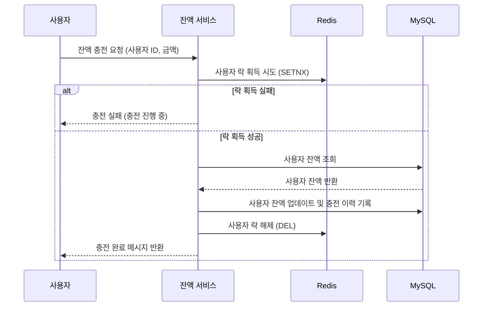
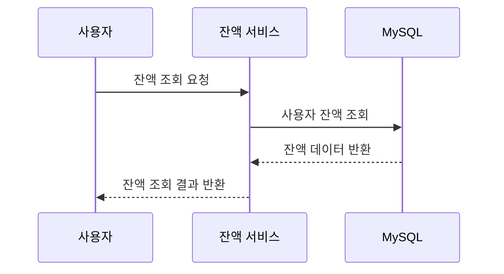
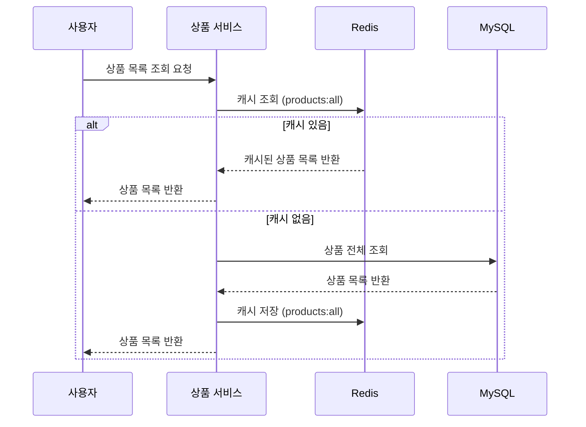
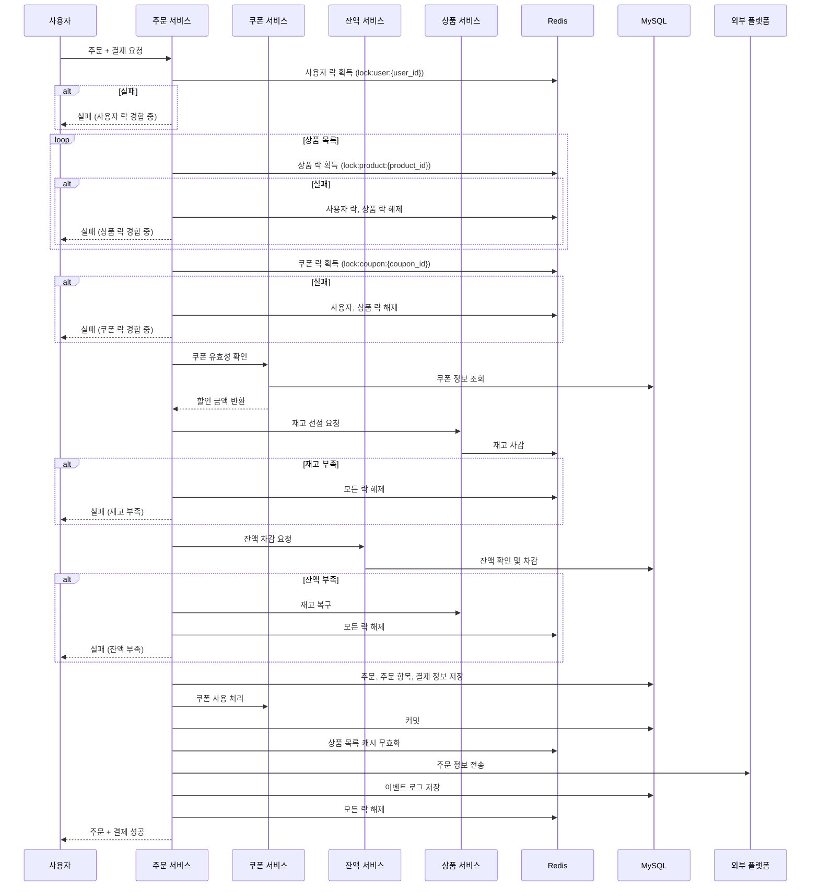
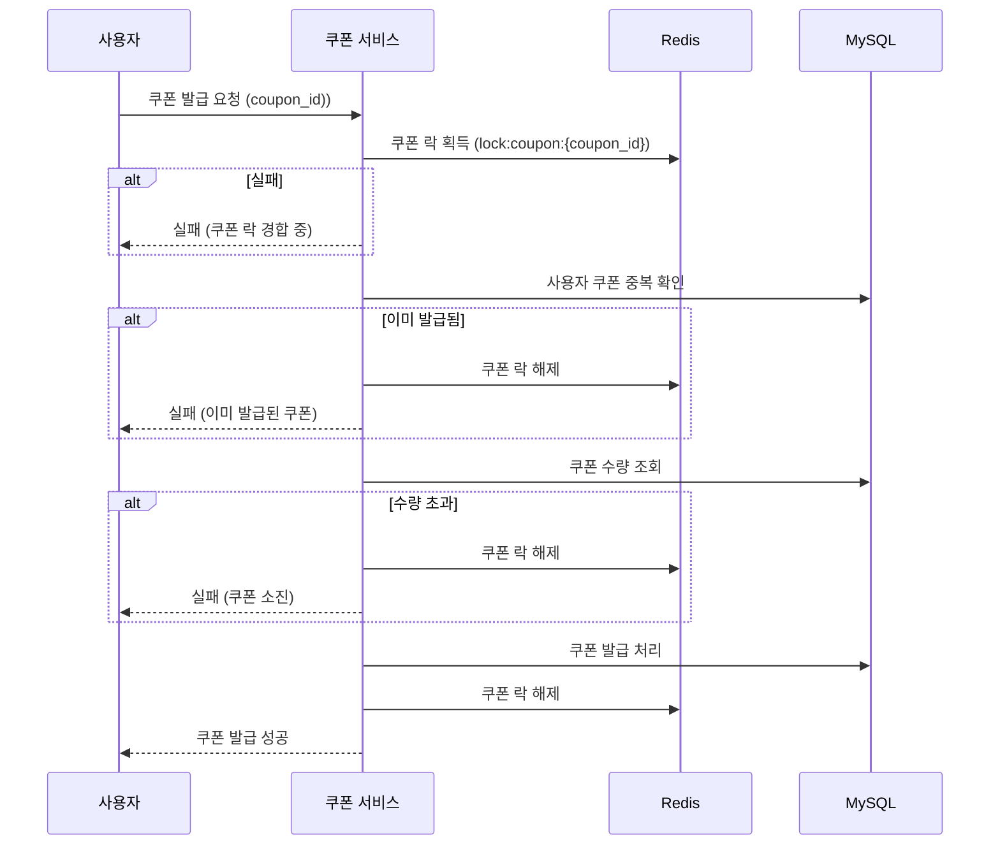
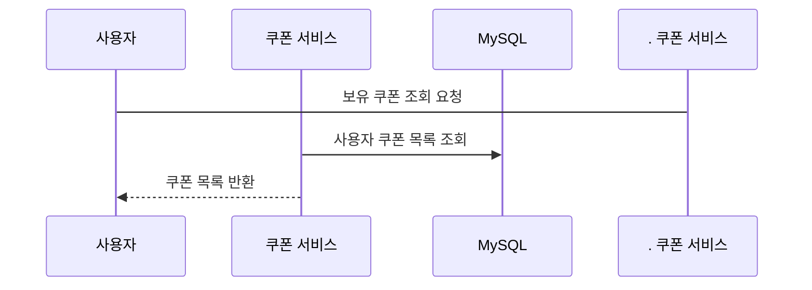
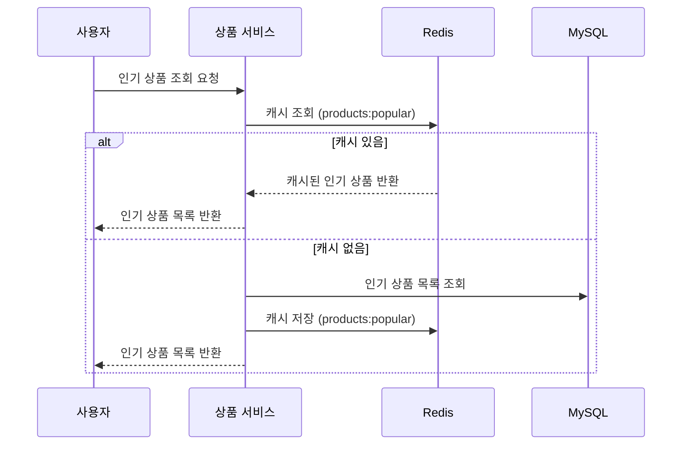

# 🛒 e-Commerce 주문 서비스 시퀀스 다이어그램
이 문서는 기능 요구사항에 따라 각 기능의 시퀀스 다이어그램을 Mermaid 문법으로 표현한 것입니다. DB는 MySQL, 필요 시 Redis를 활용합니다.

---

## ✅ 1. 잔액 충전 API

---

## ✅ 2. 잔액 조회 API

---

## ✅ 3. 상품 조회 API

---

## ✅ 4. 주문 / 결제 API

---

## ✅ 5. 쿠폰 발급 API

---

## ✅ 6. 보유 쿠폰 조회 API

---

## ✅ 7. 인기 상품 조회 API

---